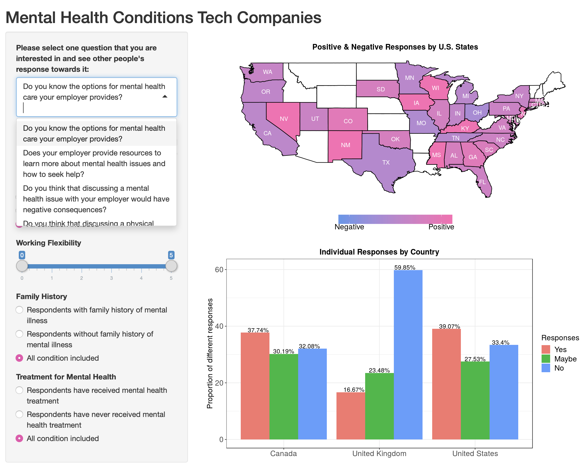
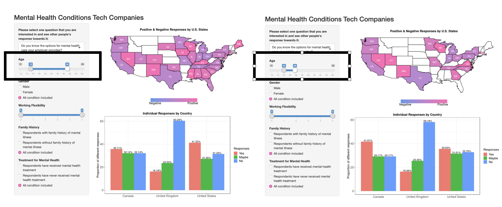
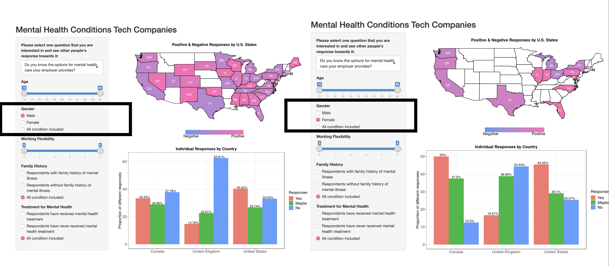
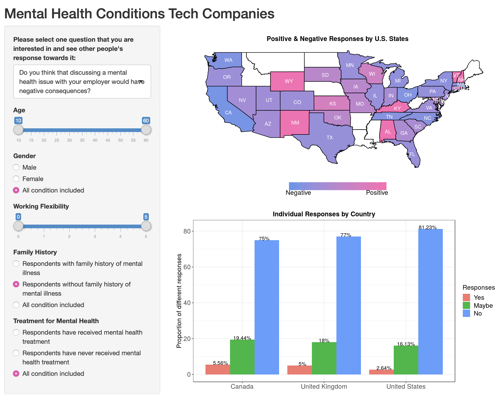

Application Usage Discription
================

This will be a small demo of how to use out app.

This app is built on the data from a survey in 2014, about mental health
care in tech workplace. Responsors from three different countries are
required to give their personal information and show they response to
ceitain questions. The data will be queried based on the conditions on
the left panel and two figures will be ploted on the left panel.

The top figure shows the averaged response for people all over the US.
The bottom figure has a parallel compare for people from different
countries.

One the topleft, you can select the question that you are interested in
viewing people’s response. Each question will generate a unique dataset
and have different visuals for the graphs on the right.

You can also have different visualizations based on the condition you
choose for the responsors: Age, Gender, their work flexibility, whether
they have family histories of mental illness, whether they ever think
about having treatment for mental health issue. By changing the
conditions, you will have difference visualizations on the right.

1.  We change the Age variable:

2.  We change the Gender variable:

3.  Or, we can change any other variables:

They all end up with unique visualizations.

Hope you enjoy the app\!
